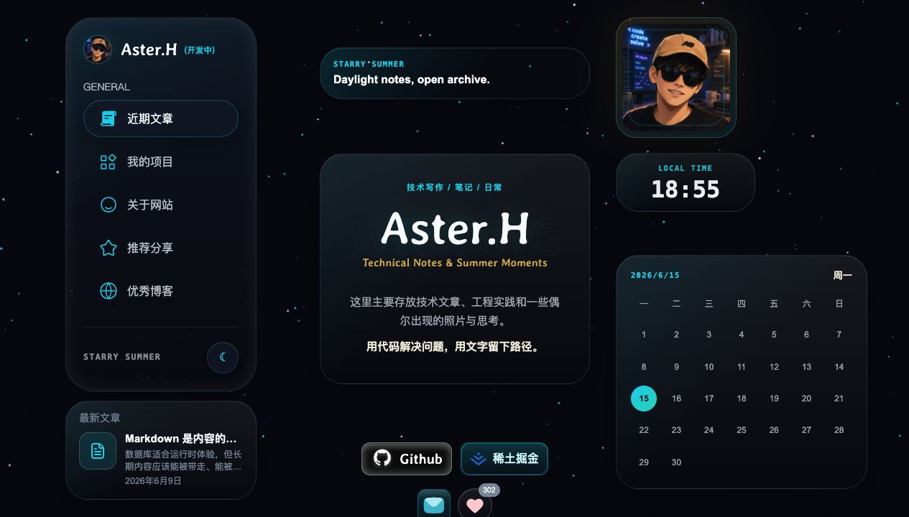
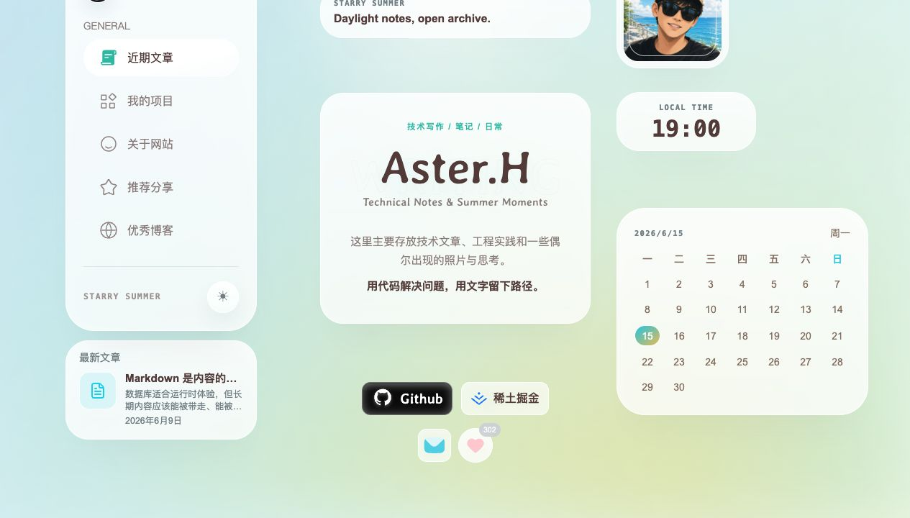
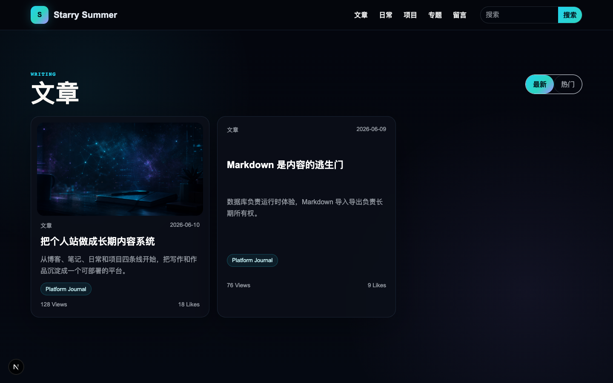
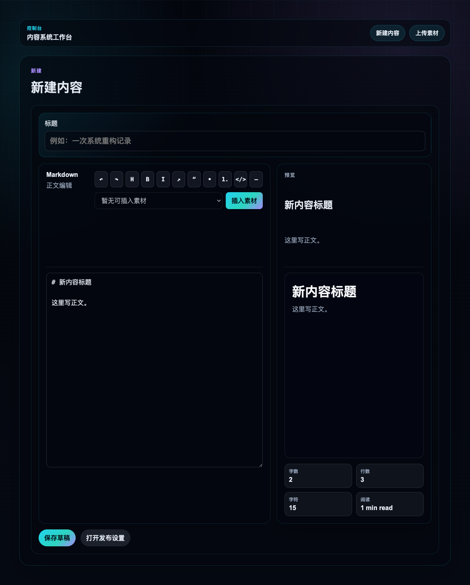
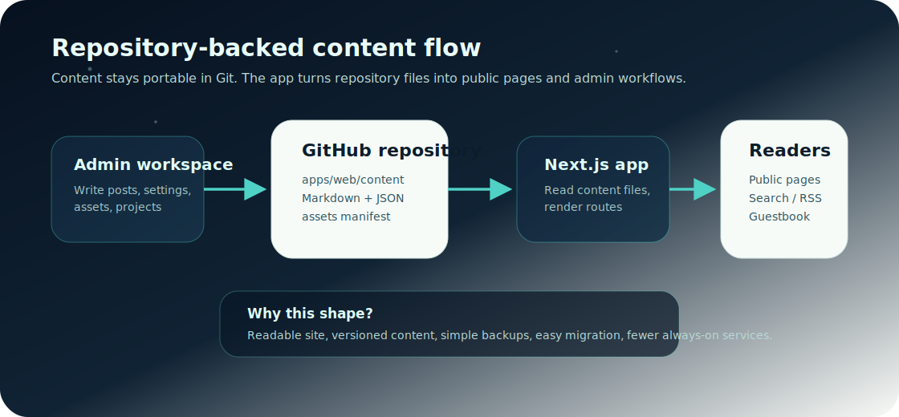
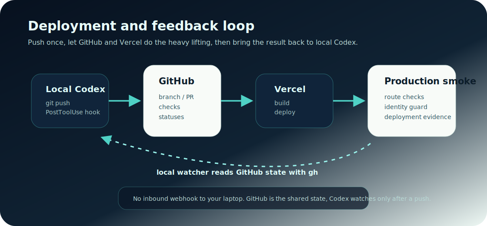

# Starry Summer

Starry Summer 是 Aster.H 自用的长期个人内容平台，用来保存公开写作、笔记、片刻、项目记录、推荐分享、刷题日记、留言、素材和部署运维信息。

它不是通用 CMS，也不是作品集或 AI 产品展示页。这个仓库更关注一件事：把一个人的长期公开内容放在可迁移、可备份、可部署、可持续维护的位置上。

这个项目的视觉方向、首页布局节奏、卡片组合和部分动效参考了 [yysuni.com](https://www.yysuni.com/) 以及对应的参考项目 [YYsuni/2025-blog-public](https://github.com/YYsuni/2025-blog-public)。Starry Summer 不是对参考项目的直接复刻：现在它已经补上了更适合自己长期使用的功能，比如刷题日记、LeetCode 学习追踪、推荐分享、中文后台、素材维护和部署反馈。

## 预览

首页夜间主题：



首页白天主题：



内容列表：



后台写作：



完整首页预览：


## 项目定位

Starry Summer 的核心是一个单人内容平台：

- 公开站点负责阅读体验、搜索、归档、RSS、推荐分享、刷题日记、留言和轻互动。
- 中文后台负责写作、内容整理、素材维护、站点设置和 LeetCode 学习追踪。
- 内容、配置和小型素材优先落在仓库中，方便审阅、备份、迁移和回滚。
- GitHub 保存代码与内容，Vercel 负责部署，必要的互动数据可以接入 Worker/KV/D1。
- 两套公开主题并存：白天主题干净、安静、易读；夜间主题保留 cyber archive 氛围。

参考项目提供的是视觉和交互方向，Starry Summer 保留的是自己的内容模型、公开身份和长期维护工作流。

## 当前能力

- 写作与发布：文章、笔记、片刻、项目记录和推荐分享。
- 内容组织：分类、标签、系列、归档、搜索和 RSS。
- 公开互动：留言板、评论入口、点赞和浏览量模型。
- 后台工作台：中文管理界面、Markdown 编辑、预览、发布设置、素材引用。
- 刷题日记：LeetCode 仪表盘、每日推荐、今日任务、复习轮次和题目笔记。
- 静态友好：内容文件、站点设置和素材索引可随 Git 一起提交。
- 运维工具：备份、恢复、健康检查、生产 smoke、部署反馈跟踪。

## 架构

Starry Summer 现在采用仓库驱动的轻量路线：



```text
apps/
  web/                 Next.js public site, admin UI, route handlers
  web/content/         repository-backed public content and settings
  web/public/          images and static assets
packages/
  shared/              shared domain types and helpers
  markdown/            Markdown parsing and rendering helpers
workers/
  interactions-worker/ optional hosted interaction worker
scripts/               env, smoke, backup, restore, hygiene checks
docs/                  deployment, security, migration notes, screenshots
```

主要内容入口：

```text
apps/web/content/public-content.json
apps/web/content/site-settings.json
apps/web/content/assets.json
apps/web/content/leetcode/dashboard.json
apps/web/content/**/*.md
apps/web/public/images/**
```

## 技术栈

- Web: Next.js, React, TypeScript
- 内容: JSON, Markdown, repository-backed files
- UI: public light/dark themes, Chinese admin workspace
- Workspace: npm workspaces
- Packages: `@starry-summer/shared`, `@starry-summer/markdown`
- Ops: Vercel, GitHub, shell checks, optional Cloudflare Worker

## 本地运行

需要：

- Node.js 22+
- npm 10+

安装依赖：

```bash
npm install
```

启动 Web：

```bash
npm run dev:web
```

默认地址：

```text
http://127.0.0.1:3000
```

常用检查：

```bash
npm test
npm run typecheck
npm run build
```

## 配置

默认静态站模式不需要后台账号密码，也不需要在 Vercel 中保存 GitHub 内容写入 token。内容和设置通过仓库文件维护，提交后由部署流程发布。

如果启用互动 Worker，可以生成互动签名密钥：

```bash
npm run auth:interaction-secret
```

生产环境变量：

```text
PUBLIC_SITE_URL=https://your-domain.example
INTERACTION_HASH_SECRET=generated-interaction-secret # 可选，仅互动 Worker 需要
```

更多配置见 [部署说明](docs/deployment.md) 和 [安全说明](docs/security.md)。

## 部署

默认生产路线是 GitHub + Vercel + 自定义域名：



Vercel 项目建议：

```text
Root Directory: apps/web
Install Command: cd ../.. && npm ci
Build Command: cd ../.. && npm run build
Output Directory: Next.js default
```

这里需要 `cd ../..`，因为 Vercel 进入 `apps/web` 后，要回到仓库根目录安装依赖并构建 workspace。

部署后可以检查：

```text
https://your-domain.example
https://your-domain.example/health
https://your-domain.example/admin/content
```

或运行：

```bash
npm run ops:smoke -- https://your-domain.example
```

## 备份与恢复

备份静态内容和图片：

```bash
npm run ops:backup
```

恢复时需要显式确认：

```bash
RESTORE_CONFIRM=YES npm run ops:restore -- backups/starry-summer-static-YYYY-MM-DD
```

本地健康检查：

```bash
npm run ops:doctor
npm run ops:smoke
```

## Codex post-push watcher

这个仓库带有一套本地 **Codex post-push watcher**：当 Codex 执行 `git push` 后，本地 hook 会短暂启动 watcher，通过 `gh` 跟踪 GitHub checks、PR 状态和 Vercel 部署结果，并把状态写入 `.codex/local/post-push-status.jsonl`。

它的目标是保留本地可见的部署反馈，不依赖常驻任务，也不要求在 GitHub Actions 中配置 OpenAI API key。说明见 [docs/ops/codex-post-push-watcher.md](docs/ops/codex-post-push-watcher.md)。

## 相关文档

- [部署说明](docs/deployment.md)
- [安全说明](docs/security.md)
- [静态托管迁移记录](docs/static-hosting-migration.md)
- [Codex post-push watcher](docs/ops/codex-post-push-watcher.md)
